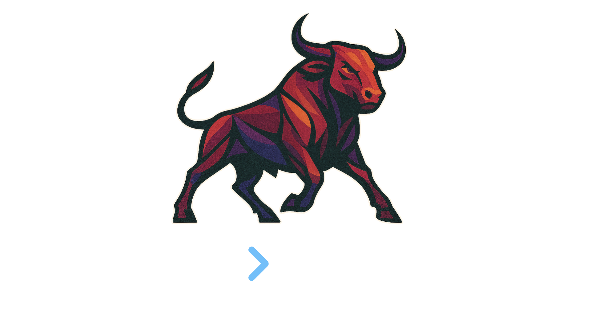

<p align="center">
  
</p>

---
# Sedryx Llydras

**Sedryx Llydras** is a minimalist, powerful Python library for **backtesting trading strategies**.

The main library is called **Llydras** — everything you need is right there.

- ✨ Intuitive `for` loop design — clean trading logic
- 📈 Automatic price and portfolio management
- 🧠 Extendable `Stats` system for analytics
- 🛠️ Flexible custom feature streams

---

## 🚀 Quick Start

```python
from llydras import Portfolio, S

# Create a portfolio
p = Portfolio('AAPL', 'JPM')

# Run a backtest
for date, price in p.trade(S.avalue)('2022-01-01', '2024-01-01'):
    if price.now < price.history.mean():
        p.buy('AAPL', 10)
    else:
        p.sell('AAPL', 5)
```

- `price.now` → Today's price
- `price.history` → All past prices up to today

---

## 📦 Core Concepts

### Portfolio

The core class that manages:

- Asset holdings
- Cash balance
- Portfolio value
- Trade execution

```python
p = Portfolio('AAPL', 'GOOG', 'MSFT')
```

---

### Trading Loop

Your entire strategy lives inside a `for` loop:

```python
for date, price, volatility in p.trade(S.avalue, S.avolatility)('2022-01-01', '2024-01-01'):
    ...
```

Each feature (like `price`, `volatility`) behaves like a **Stream**:

```python
price.now         # Current day's value
price.history     # Full history up to today
```

---

### Stream

Features accessed inside the loop are **Stream** objects.

Stream gives you:

| Attribute | Meaning |
|:----------|:--------|
| `.now` | Current day's data |
| `.history` | Historical data up to current day |

---

## 📊 Stats: Smart Analytics Built In

Add custom statistical functions easily:

```python
from llydras import Stats

@Stats.add
def beta(data: pd.Series):
    ...
```

This automatically creates:

- `S.abeta` → Asset betas
- `S.pbeta` → Portfolio beta

Use them inside `.trade()`:

```python
for date, ar, pr in p.trade(S.areturn, S.preturn)('2022-01-01', '2024-01-01'):
    ...
```

You can define **three types** of statistical functions:

- **Asset-based**
- **Portfolio-based**
- **Full portfolio access**

---

## ⚙️ Trade Features

Available streams you can use in `.trade()`:

| Feature | Description |
|:--------|:------------|
| `S.avalue` | Asset price |
| `S.areturn` | Asset returns |
| `S.pvalue` | Portfolio total value |
| `S.preturn` | Portfolio total returns |
| `S.weights` | Portfolio weights |
| *(plus your custom Stats!)* | |

---

## 📈 Example Strategy

Buy AAPL if today's price is below its 20-day average:

```python
for date, price in p.trade(S.avalue)('2022-01-01', '2023-01-01'):
    moving_avg = price.history.rolling(20).mean()
    if price.now < moving_avg.iloc[-1]:
        p.buy('AAPL', 5)
    else:
        p.sell('AAPL', 5)
```

---

## 🛠️ Installation

Coming soon:

```bash
pip install llydras
```

---

## 🌟 Why Sedryx Llydras?

- No unnecessary complexity
- Natural Python feeling
- Powerful statistics built-in
- Easily extendable
- Just you, your portfolio, and the markets

---

## 📚 Roadmap

- Live trading support
- Performance analytics (Sharpe ratio, drawdowns, etc.)
- Multi-strategy backtesting
- Strategy optimization tools

---

# ✨ Sedryx Llydras
> *Simple Backtesting, Deep Power.*

---

---
## Acknowledgment

README generated with assistance from ChatGPT; all code and design decisions are my own.
